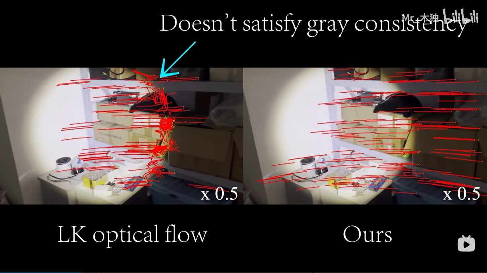
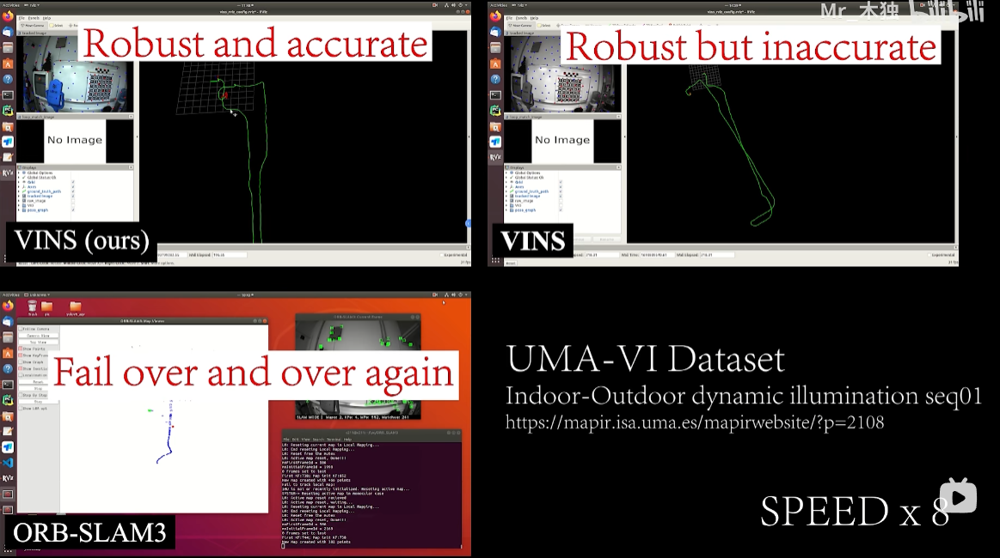
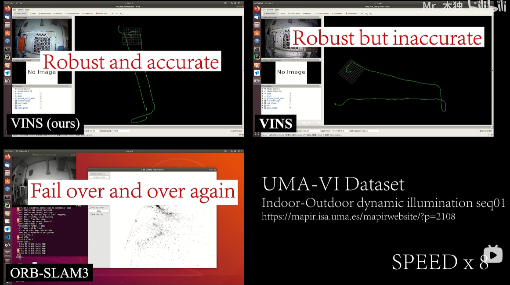

# LET-NET: A lightweight CNN network for sparse corners extraction and tracking

LET-NET implements an extremely lightweight network for feature point extraction and image consistency computation. The network can process a 240 x 320 image on a CPU in about 5ms. Combined with LK optical flow, it breaks the assumption of brightness consistency and performs well on dynamic lighting as well as blurred images.

<div display:inline>
  <a href="https://www.bilibili.com/video/BV1gz4y1V77M/?vd_source=4dd69fa6d40221a0fa0733def5c4708a#reply576226249"></a>
  <a href="https://www.bilibili.com/video/BV1gz4y1V77M/?vd_source=4dd69fa6d40221a0fa0733def5c4708a#reply576226249"></a>
  <a href="https://www.bilibili.com/video/BV1gz4y1V77M/?vd_source=4dd69fa6d40221a0fa0733def5c4708a#reply576226249"></a>
</div>

## News 

1. [Training Code](https://github.com/linyicheng1/LET-NET/blob/main/assets/LETNet.zip) The LET-NET training code is released.
2. Gray Image is also suport in LET-NET, you can get pytorch and onnx model tpye in `./model/`
3. [LET-VINS](https://github.com/linyicheng1/LET-NET/blob/main/assets/VINS-Mono.zip) Demo run on UMA-VI dataset is released.
4. Our proposed LET-VINS won the second place in the VIO track of the ICCV2023SLAM Challenge, which is the best performance among the traditional methods.
5. The preprinted paper was posted at [here](https://arxiv.org/abs/2310.15655).


## Related Paper

- **Breaking of brightness consistency in optical flow with a lightweight CNN network**,Yicheng Lin, Shuo Wang, Yunlong Jiang, Bin Han, arXiv:2310.15655, [pdf](https://arxiv.org/pdf/2310.15655.pdf) 

## 1. Prerequisites 

- OpenCV (https://docs.opencv.org/3.4/d7/d9f/tutorial_linux_install.html)
- ncnn (https://github.com/Tencent/ncnn/wiki/how-to-build#build-for-linux)

> Notes: After installing ncnn, you need to change the path in CMakeLists.txt

```
set(ncnn_DIR "<your_path>/install/lib/cmake/ncnn" CACHE PATH "Directory that contains ncnnConfig.cmake")
```
## 2. Build 

```
mkdir build && cd build
cmake .. && make -j4
```

## 3. Run demo 

You can enter the path to a video or two images.
```
./build/demo <path_param> <path_bin> <path_video>
```
or 
```
./build/demo <path_param> <path_bin> <path_img_1> <path_img_2>
```
For example using the data we provide:

```
./build/demo ../model/model.param ../model/model.bin ../assets/nyu_snippet.mp4
```

You should see the following output from the NYU sequence snippet:


## 4. Examples 

### Dynamic lighting

The left is ours and the right is the original optical flow algorithm.

<table><tr>
<td></td>
<td></td>
</tr></table>

### Underwater

The left is ours and the right is the original optical flow algorithm.

<table><tr>
<td></td>
<td></td>
</tr></table>

### Active light source

The left is ours and the right is the original optical flow algorithm.

<table><tr>
<td></td>
<td></td>
</tr></table>

## 5. Cite

```
@misc{let-net,
      title={Breaking of brightness consistency in optical flow with a lightweight CNN network}, 
      author={Yicheng Lin and Shuo Wang and Yunlong Jiang and Bin Han},
      year={2023},
      eprint={2310.15655},
      archivePrefix={arXiv}
}
```
