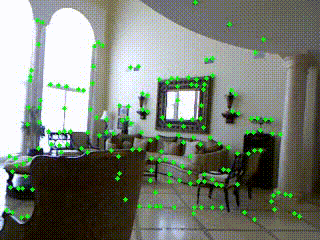

# LET-NET: A lightweight CNN network for sparse corners extraction and tracking

LET-NET implements an extremely lightweight network for feature point extraction and image consistency computation. The network can process a 240 x 320 image on a CPU in about 5ms. Combined with LK optical flow, it breaks the assumption of brightness consistency and performs well on dynamic lighting as well as blurred images.


## 1. Prerequisites 

- OpenCV (https://docs.opencv.org/3.4/d7/d9f/tutorial_linux_install.html)
- ncnn (https://github.com/Tencent/ncnn/wiki/how-to-build#build-for-linux)

> Notes: After installing ncnn, you need to change the path in CMakeLists.txt

```
set(ncnn_DIR "<your_path>/install/lib/cmake/ncnn" CACHE PATH "Directory that contains ncnnConfig.cmake")
```
## 2. Build 

```
mkdir build && cd build
cmake .. && make -j4
```

## 3. Run demo 

You can enter the path to a video or two images.
```
./build/demo <path_param> <path_bin> <path_video>
```
or 
```
./build/demo <path_param> <path_bin> <path_img_1> <path_img_2>
```
For example using the data we provide:

```
./build/demo ../model/model.param ../model/model.bin ../assets/nyu_snippet.mp4
```

You should see the following output from the NYU sequence snippet:



## 4. Examples 

### Dynamic lighting

The left is ours and the right is the original optical flow algorithm.

<table><tr>
<td></td>
<td></td>
</tr></table>

### Underwater

The left is ours and the right is the original optical flow algorithm.

<table><tr>
<td></td>
<td></td>
</tr></table>

### Active light source

The left is ours and the right is the original optical flow algorithm.

<table><tr>
<td></td>
<td></td>
</tr></table>

